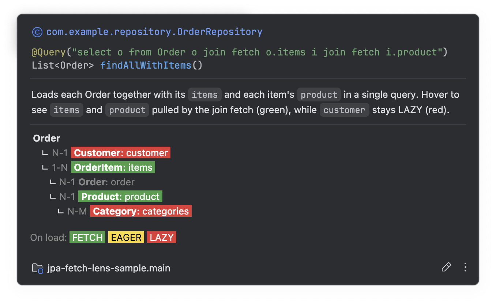
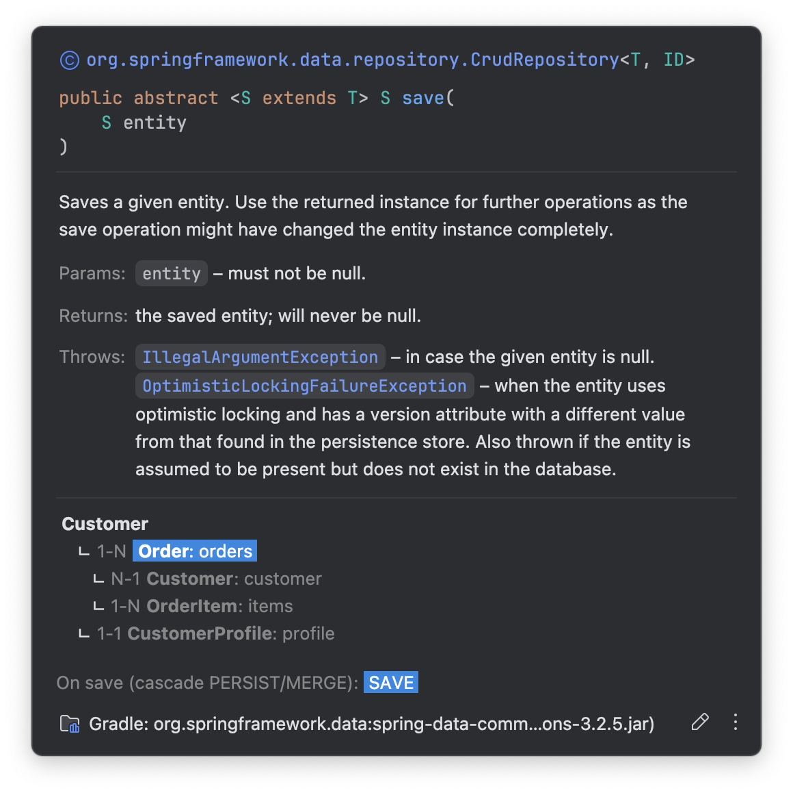
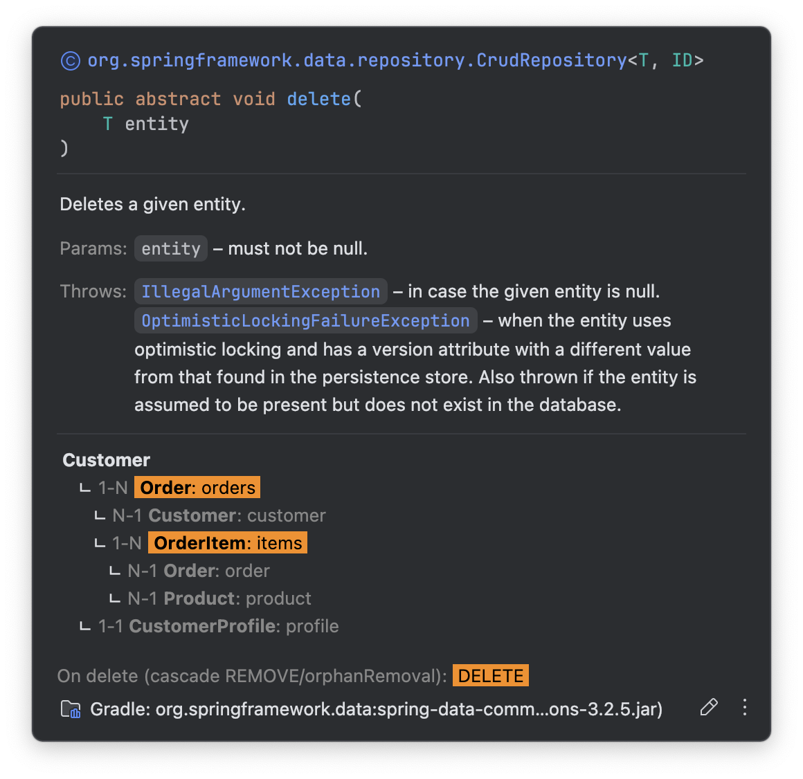

# JPA Fetch Lens

[English](README.md) | 한국어

[](LICENSE)

> Spring Data JPA repository 메서드에 마우스를 올리면, 그 메서드의 **영향이 엔티티 그래프에서
> 어디까지 미치는지**를 색 트리로 보여준다 — 조회는 무엇을 **로딩**하는지, `save`/`delete`는
> 무엇이 **cascade** 되는지.



메서드 이름만 봐서는 안 보이는 것 — N+1 위험, `LAZY`로 적었지만 Hibernate가 EAGER로 당겨오는
함정, 또는 자식까지 조용히 지워버리는 `delete` — 이 편집기를 떠나지 않고 드러난다. 트리는 hover
시 메서드의 기본 Java 문서 **아래에** 붙는다.

## 기능

- **조회 메서드 → fetch 트리** — 조회 엔티티와 실제로 로딩되는 연관을 중첩해 표시. 초록 = 이 쿼리가
  당김(`join fetch` / `@EntityGraph`), 노랑 = EAGER 매핑, 빨강 = LAZY(프록시, N+1 위험).
- **`save` → cascade 트리** — `PERSIST` / `MERGE`로 함께 저장되는 연관은 파랑으로 펼치고, 나머지는
  회색(저장이 거기서 멈춤).
- **`delete` → cascade 트리** — `REMOVE`나 `orphanRemoval`로 함께 삭제되는 연관을 주황으로 펼쳐,
  예상 못 한 연쇄 삭제를 실행 *전에* 보여준다.
- **로딩·전파가 없는 건 건너뜀** — `count`·`exists`·스칼라/DTO 프로젝션은 트리를 그리지 않는다.
  이름이 아니라 **반환 타입**으로 판정하므로, 이름이 `findBy…`여도 실제로 `count`(`long` 반환)면
  올바르게 트리가 없다.
- **매핑과 쿼리를 함께 해석** — `@ManyToOne` / `@OneToOne` / `@OneToMany` / `@ManyToMany`
  (jakarta·javax), `@Query`의 `join fetch`(별칭 체인 해석), `@EntityGraph(attributePaths)`.
- **함정 표시** — 비소유 `@OneToOne`에 `LAZY`를 줘도 Hibernate는 EAGER로 로딩하며, 이를 표시한다.
- **역참조** — 이미 로딩된 상위로 되돌아가는 연관은 접근해도 쿼리가 없으므로 색 없이 표시.
- **색 설정** — 다섯 색(LAZY / EAGER / FETCH / save cascade / delete cascade) 모두
  Settings | Tools | JPA Fetch Lens 에서 변경.

## 설치

- **IDE에서:** Settings/Preferences → Plugins → Marketplace → **JPA Fetch Lens** 검색 → Install.
- **수동:** 플러그인 ZIP을 받아 Plugins → ⚙ → *Install Plugin from Disk…*

IntelliJ IDEA **Community·Ultimate 모두** 동작한다 — Java PSI로 동작하므로 전용 JPA 플러그인이
필요 없고, 분석 대상 프로젝트에 JPA / Spring Data JPA 의존과 애노테이션만 있으면 된다.

## 사용법

repository 메서드에 hover 한다. 예를 들어:

```java
@Query("select o from Order o join fetch o.items i join fetch i.product")
List<Order> findAllWithItems();
```

```
Order
     └ N-1  Customer: customer                    (빨강, LAZY)
     └ 1-N  OrderItem: items                      (초록, FETCH)
          └ N-1  Order: order                     (회색, 역참조)
          └ N-1  Product: product                 (초록, FETCH)
     └ 1-1  ShippingInfo: shipping   LAZY ignored → loads EAGER   (노랑)
```

카디널리티: `N-1`(@ManyToOne), `1-N`(@OneToMany), `1-1`(@OneToOne), `N-M`(@ManyToMany).

`save`·`delete`에 hover 하면 트리는 **cascade** 로 바뀐다 — 엔티티와 함께 저장/삭제되는 범위.
`save`는 `PERSIST`/`MERGE` cascade(파랑), `delete`는 `REMOVE`/`orphanRemoval`(주황)을, 전파가
어디까지 미치는지 펼쳐서 보여준다:





`count`·`existsById`와 스칼라/DTO 프로젝션은 트리를 아예 그리지 않는다 — 엔티티 그래프를
materialize 하지 않기 때문. 이름이 아니라 **반환 타입**으로 판정하므로
`@Query("select count(o) …") long findByFoo()` 같은 경우도 올바르게 처리된다.

### 색의 의미

색은 항상 **"이 연산이 미치는 범위"** 를 뜻한다. 연산이 무엇인지는 메서드에 따라 다르다:

| 색 | 뜻 |
|----|----|
| 🟢 초록 | 조회: 로딩됨 — `join fetch` / `@EntityGraph` |
| 🟡 노랑 | 조회: EAGER 매핑 — 항상 로딩 |
| 🔴 빨강 | 조회: LAZY — 프록시. 접근 시 추가 쿼리(N+1 위험) |
| 🔵 파랑 | `save`: cascade — `PERSIST` / `MERGE` |
| 🟠 주황 | `delete`: cascade — `REMOVE` / `orphanRemoval` |
| ⚪ 회색 | 범위 밖 — 역참조, 또는 이 연산이 cascade 하지 않는 연관 |

범위에 든(초록, 조회에선 EAGER 포함) 연관만 그 대상까지 펼치고 나머지는 잎으로 둔다. 팝업 상단
캡션이 지금 어떤 모드인지 알려준다.

> 위 색은 **기본값**이며 다섯 가지(LAZY / EAGER / FETCH / save cascade / delete cascade) 모두
> Settings | Tools | JPA Fetch Lens 에서 바꿀 수 있다. 편집기 캡션은 항상 *설정된* 색으로 그리므로
> 트리와 어긋나지 않는다.

## 설정

**Settings → Tools → JPA Fetch Lens** 에서 다섯 색 — LAZY / EAGER / FETCH(조회)와
Save cascade / Delete cascade — 을 직접 고른다. 글자색은 배경 밝기에 따라 검정/흰색으로 자동
대비된다.

## 한계

- **런타임 요인은 반영하지 못한다.** 영속성 컨텍스트/2차 캐시에 이미 있으면 LAZY여도 쿼리가 안 나가고,
  `@BatchSize` / `default_batch_fetch_size`는 LAZY 로딩 방식을 바꾼다. 실제 동작은 Hibernate SQL
  로그로 확인해야 한다.
- `@Query(nativeQuery = true)`는 분석하지 않는다 (SQL이라 매핑 밖).
- `@NamedEntityGraph`(이름 참조)는 아직 미지원 — 인라인 `attributePaths`만.
- 게터(property 접근)에 매핑된 연관은 아직 미지원.
- `getReferenceById` / `getOne`은 의도적으로 트리를 그리지 않는다 — 반환 타입은 엔티티지만 지연
  로딩 프록시만 돌려주고 아무것도 로딩하지 않기 때문.

## 개발

```bash
./gradlew runIde       # 샌드박스 IDE로 실제 확인
./gradlew buildPlugin  # 마켓플레이스 배포용 ZIP
```

## 라이선스

[MIT](LICENSE) © jeong-donghee
