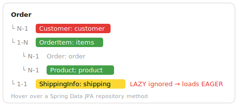

# JPA Fetch Lens

English | [한국어](README.ko.md)

[](LICENSE)

> Hover over a Spring Data JPA repository method to see, as a color-coded tree, which
> associated entities that query actually loads.



What the method name hides — N+1 risks, over-fetching, or a `LAZY` field that Hibernate loads
eagerly anyway — becomes visible without leaving the editor. The tree is appended right below
the method's normal Java documentation on hover.

## Features

- **Per-method fetch tree** — the queried entity and the associations that get loaded, nested
  by what is actually fetched.
- **Color-coded by effective fetch** — green = pulled by this query (`join fetch` /
  `@EntityGraph`), yellow = EAGER mapping, red = LAZY (proxy, potential N+1).
- **Reads mappings and query together** — `@ManyToOne` / `@OneToOne` / `@OneToMany` /
  `@ManyToMany` (Jakarta and javax), `@Query` `join fetch` with alias resolution, and
  `@EntityGraph(attributePaths)`.
- **Expands what is loaded** — eagerly loaded or fetched associations expand to their own
  associations, so you follow the real object graph one hover deep.
- **Flags a pitfall** — a non-owning `@OneToOne` declared `LAZY` is loaded EAGER by Hibernate,
  and is marked accordingly.
- **Back-references** to an already-loaded parent are shown without color, since navigating to
  them triggers no extra query.
- **Configurable colors** — Settings | Tools | JPA Fetch Lens.

## Installation

- **From the IDE:** Settings/Preferences → Plugins → Marketplace → search **JPA Fetch Lens** → Install.
- **Manually:** download the plugin ZIP, then Plugins → ⚙ → *Install Plugin from Disk…*

Works in IntelliJ IDEA **Community and Ultimate** — it relies on Java PSI, so no dedicated JPA
plugin is required, just a project with JPA / Spring Data JPA on the classpath.

## Usage

Hover over a repository method. For example, with:

```java
@Query("select o from Order o join fetch o.items i join fetch i.product")
List<Order> findAllWithItems();
```

```
Order
     └ N-1  Customer: customer                    (red,   LAZY)
     └ 1-N  OrderItem: items                      (green, FETCH)
          └ N-1  Order: order                     (gray,  back-reference)
          └ N-1  Product: product                 (green, FETCH)
     └ 1-1  ShippingInfo: shipping   LAZY ignored → loads EAGER   (yellow)
```

Cardinality is shown as `N-1` (@ManyToOne), `1-N` (@OneToMany), `1-1` (@OneToOne),
`N-M` (@ManyToMany).

### Color legend

| Color | Meaning |
|-------|---------|
| 🟢 Green | Pulled by this query (`@Query` join fetch or `@EntityGraph`) |
| 🟡 Yellow | EAGER mapping — always loaded, regardless of the query |
| 🔴 Red | LAZY — a proxy; touching it triggers another query (N+1 risk) |
| ⚪ No color | Back-reference to an already-loaded parent; no query on access |

Only loaded (green/yellow) associations are expanded to their own associations; LAZY ones are leaves.

## Configuration

**Settings → Tools → JPA Fetch Lens** lets you pick the LAZY / EAGER / FETCH colors. Text color
adapts (black/white) to the background for contrast.

## Limitations

- **Runtime factors are not reflected.** An entity already in the persistence context / L2 cache
  won't trigger a query even if LAZY, and `@BatchSize` / `default_batch_fetch_size` change how
  LAZY loads. Verify actual behavior with Hibernate SQL logging.
- `@Query(nativeQuery = true)` is not analyzed (it is SQL, outside the mapping).
- `@NamedEntityGraph` (by-name reference) is not yet supported — only inline `attributePaths`.
- Associations mapped on getters (property access) are not yet supported.

## Development

```bash
./gradlew runIde       # launch a sandbox IDE with the plugin
./gradlew buildPlugin  # build the distributable ZIP
```

## License

[MIT](LICENSE) © eehgnod
